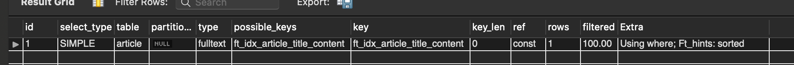
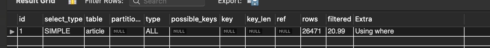

# mysql full-text index
- `전문검색(full-text search)`은 게시물의 내용이나 제목 등과 같이 `문장에서 키워드를 검색`하는 기능
- `LIKE` `%%`로 검색하면 인덱스를 사용하지 못한다. 
- version 5.6 이상부터 innodb도 적용 가능 
- `char`, `varchar`, `text` 타입 가능
- `set global innodb_ft_aux_table = 'springdb/article'`로 지정해두면 `select * from information_schema.innodb_ft_index_table;`로 인덱스 관련 정보를 조회할 수 있다.  

# 인덱스 알고리즘 
## Full-Text Stopword. 구분자. 불용어
- `띄어쓰기`나 `문장 기호`를 기준으로 `키워드를 추출`
  + ex) `hello world` -> `hello`, `world`
- 키워드가 `전부 일치`하거나 `prefix가 일치`할 때만 조회
- 지정된 구분자에 의해서만 인덱싱을 처리하도록 키워드 추출 알고리즘 사용.
  + `select * from information_schema.innodb_ft_default_stopword;`로 mysql에서 제공하는 기본 stopworld 키워드 조회 가능
- `추출한 키워드가 stopword 테이블에 완전히 일치하는게 존재한다면, 키워드 목록에 추가되지 않음.` stopword에 정의된 키워드로는 검색이 불가능함.
- 기본적으로 영어이고, 영문의 대소문자를 구분하지 않음. collation을 수정하면 대소문자 구분 가능.
- stopword를 사용자가 정의한 테이블로 변경할 수 있다.

### 사용자 정의 stopword 테이블 생성 및 데이터 추가
- stopword 테이블 변경
- ```mysql
  -- 테이블 지정
  set global innodb_ft_server_stopword_table = "testdb/custom_stopword";
  -- 조회 
  show variables like 'innodb_ft_server_stopword_table';
  ```
- 테이블 생성
- ```mysql
  create table user_stopword (value varchar(30) not null);
  
  insert into user_stopword(value) values ('가까스로'), ('가령'), ('각각'), ('각자'), ('각종'), ('갖고말하자면'), ('같다'), ('같이'), ('개의치않고'), ('거니와');
  ```
- mysql을 재시작하면 초기화 되므로 주의! 영구적으로 사용하고 싶다면 /etc/mysql/my.cnf 파일에 등록

## N-그램
- 단어나 어휘를 고려하지 않고 `본문의 내용`을 `N`으로 잘라서 사용
- 전세계 언어를 고려했을 때, 합리적인 방법
- version 5.7 부터 추가
- `/etc/mysql/my.cnf`에서 토큰 사이즈 수정 가능 `ngram_token_size=2`. `1~10`까지 지정 가능
- 기존 innodb_ft_min_token_size, innodb_ft_max_token_size, ft_min_word_len, and ft_max_word_len 파라미터는 무시됌
- full-text index 생성시 `with PARSER ngram`문 추가해야함.
  + `CREATE FULLTEXT INDEX ft_idx_notice_title_content on article(title, contents) with PARSER ngram`
- `stopword`는 `기본 full-text와 동작이 다른데, 토큰화된 단어에 stopword가 포함되어 있으면 키워드 목록에 추가되지 않음`.
  + ex) token: `hi,`, `hh,`. stopworld: `,`로 정의되어 있다면 `,`가 포함되는 `hi,`, `hh,`는 목록에서 제외. 쓸모없는 토큰을 필터링 할 수 있음

## full-text index 생성 
- DDL 생성시 CREATE TABLE statement 
- ALTER TABLE
- CREATE INDEX
  + `CREATE FULLTEXT INDEX ft_idx_notice_title_content ON article(title, contents)` + `with PARSER ngram`

## full-text 쿼리 
- `MATCH() ... AGAINST` 구문으로 조회 가능
- `SELECT * FROM article WHERE MATCH(title, content) AGAINST ('코로나');`
- MATCH() 괄호 안에는 반드시 full-text index 생성시 지정한 `모든 컬럼을 명시`해야한다.  
  + 그렇지 않으면 `1191. Cant't find FULLTEXT index matching the column list` 에러 발생  

## 검색 방법 
### IN NATURAL LANGUAGE MODE. default 
- `The full-text engine splits the phrase into words and performs a search in the FULLTEXT index for the words.`
- `검색 키워드를 토큰으로 쪼개서 키워드 목록 서치해봄.`
- 예를 들어 다음과 같이 저장되어 있을 때
- ```
  1. '코로'
  2. '코로나 거리두기'
  3. '코로나나'
  ```
- `select * from article where match(title) against ('코로나나');` 결과는 다음과 같다. `정확도가 높은 순서대로` 조회가 된다.  
- ```
  3. '코로나나'
  2. '코로나 거리두기'
  1. '코로'
  ```
- 참고로 `select * from article where match(title) against ('코로나나' in boolean mode);` 조회시 토큰으로 쪼개서 조회하지 않고 `코로나나`로만 조회하므로 `3, 코로나나`만 조회된다. 

### IN BOOLEAN MODE
- 키워드의 포함, 불포함을 지정할 수 있다.
  + `없으면 or 연산`:  AGAINST('hello name' IN BOOLEAN MODE);
  + `+는 AND 연산`:  AGAINST('+hello +name' IN BOOLEAN MODE);
  + `-는 NOT 연산`:  AGAINST('+hello -name' IN BOOLEAN MODE);

# like vs fulltext 성능 비교 
## 1. 더미 데이터 생성 
- 한글입숨 API 사용 
  + http://hangul.thefron.me. https://github.com/thefron/hangul_ipsum
- DummyDataController를 호출해서 `article` 테이블에 데이터 `3만개` 추가

## 2. mysql fulltext 설정
- `n-gram` 알고리즘 선택 
- mysql fulltext index 생성
- ```
  alter table article drop index ft_idx_article_title_content;
  create fulltext index ft_idx_article_title_content on article(title, content) with parser ngram;
  ```
- `/etc/mysql/my.cnf`에서 `ngram_token_size=2` 추가 
- ```
  set global innodb_ft_aux_table = 'springdb/article'; //설정 시 역 인덱스 볼 수 있음  
  show variables like 'innodb_ft_aux%';
  
  set global innodb_optimize_fulltext_only = on;
  optimize table article;
  set global innodb_optimize_fulltext_only = off;
  ```

## 3. 비교 테스트
- article에 저장되어있는 데이터로 검색 
- `어떤 단어로 검색을 해야할까?` 

### 1차 시도 
- `쓸쓸` 키워드로 검색 시도 
- ```
  SELECT * FROM article where match(title, content) against ('쓸쓸');
  SELECT * FROM article where content like '%쓸쓸%' or title like '%쓸쓸%';
  ```

- 검색 결과를 보면 fulltext 검색이 0.125, like 검색이 0.049로 더 느리다..?



- explain으로 각각 보면 fulltext 인덱스를 잘 타고있고, like 검색은 full-scan임을 확인했다. 
 

### 2차 시도
- `쓸쓸` 키워드로 재시도. 캐시 문제일 수도 있으니 NOW()를 이용해 캐시 사용 안하도록 
- ```
  SELECT *, NOW() FROM article where match(title, content) against ('쓸쓸');
  SELECT *, NOW() FROM article where content like '%쓸쓸%' or title like '%쓸쓸%';
  ```

- 결과를 보니 `1차와 별반 다르지않음.`
- count(*)로 갯수를 보니 둘 다 `18697`로 동일하게 나온다.
- 생각해보니 30000개 중에 검색 결과가 18697개라면 전체의 `60%`가 넘는다.. 이런 경우 full-scan이 더 빠를 수 있다.

### 3차 시도
- 비교적 적게 등장하는 `하랴?` 키워드로 검색 시도  
- ```
  SELECT id, NOW() FROM article where match(title, content) against ('하랴?');
  SELECT id, NOW() FROM article where content like '%하랴?%' or title like '%하랴?%';
  ```

- 비교적 검색결과가 적은 키워드로 하니, fulltext가 like 검색보다 3배 더 빠르다. 데이터가 많을 수록 이 차이는 클거라 예상된다.  
- count(*)의 갯수는 8207개로 27%정도 되지만 like검색보다 fulltext가 더 빠른걸 볼 수 있다. 
- `검색 결과가 전체 개수에 가까울수록 fulltext보다 full-scan이 더 빠르니 조심하자`  

## docker로 설정시 필요한 명령어 
- `docker exec -it mysql_boot bash` 도커 컨테이너 접속
- ```
  //vim 설치
  apt-get update
  apt-get install vim
  ```
- `vi /etc/mysql/my.cnf` mysql 설정 파일 수정
  
## 참고  
- https://dev.mysql.com/doc/refman/8.0/en/innodb-fulltext-index.html
- https://dev.mysql.com/doc/refman/8.0/en/fulltext-search.html


