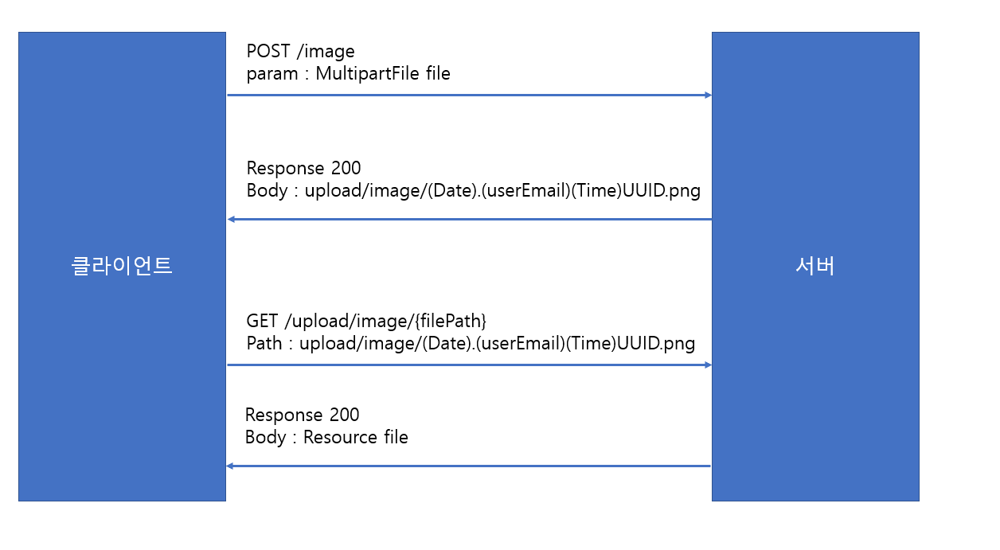
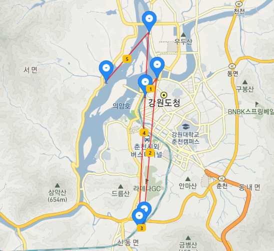

# Travel-Community V1.0

여행에 대한 자료를 공유하고, 토론하는 커뮤니티입니다.

## 프로젝트 시연 영상 

[](https://youtu.be/D_vpl5GnkeE)

## 기술스택

- `Spring boot` Version 2.2.4
    - `Java` Version 1.8
    - `Maven` 
    - `Spring Framework` Version 5.2.3
    - `Thymeleaf`  Version 3.0.11
    - `Junit` Version 4.12
- `Mybatis` Version 2.1.1
- `Flyway` Version 6.0.8
- `Mysql` Version 8.0.19
- `lombok` Version 1.18.10

<br>

- `javascript` 
- `Bootstrap` Version 4.4.1
- `jQuery` Version 3.4.1
- `Summernote` Version 0.8.16

<br>

- `github`

## 데이터베이스 구조


## 기능 구현

### 회원 정보 저장

Spring security를 사용하지 않고, 직접 데이터베이스에 저장하는 방식으로 구현했습니다.

- `패스워드`를 원문 그대로 저장하는 것은 매우 위험합니다. 따라서 암호화를 하거나 해시화를 하는 것이 일반적입니다. 저는 `SHA-256` 해시 알고리즘을 이용해 패스워드를 저장했습니다. 

- 서로 다른 유저가 동일한 패스워드를 사용할 경우, `SHA-256`의 결과도 동일합니다. 이는 `통계적 공격`에 이용될 여지가 있습니다. 따라서 저는 `Salt`라는 난수를 생성하여 동일한 패스워드에도 `SHA-256` 결과가 다른 값을 같도록 만들었습니다.

**참고 사진**


#### Q. 암호화를 사용하지 않고 해시함수를 사용한 이유는?

패스워드 저장에 사용되는 암호 알고리즘은 `AES`와 같은 대칭키 알고리즘이 주로 사용됩니다. 즉, **키를 안전하게 보관할 의무가 생긴다는 단점**이 있습니다. 외부로의 유출뿐만 아니라, 키를 알고 있는 관계자는 유저의 패스워드를 확인이 가능한 문제도 발생할 수 있습니다.

또한, 알고리즘의 시간복잡도를 고려했을 때에도, 암호화보다는 **해시화가 속도가 더 빠르다는 장점을 고려**했습니다. 


<hr>

### 페이징

페이징 처리를 하기 위해 페이지에 대한 정보를 저장하는 클래스를 생성했습니다. 클래스의 구조는 다음과 같습니다.

```java
@Getter
public class Page {
    int recordsPerPage;      //한 페이지에 보여질 데이터의 수
    int firstPageNo;         //첫 번째 페이지 번호 1
    int finalPageNo;         //마지막 페이지 번호
    int currentPageNo;       //현재 페이지 번호  x
    int prevPageNo;          //이전 페이지 번호 x-1
    int nextPageNo;          //다음 페이지 번호 x+1
    int startPageNo;         //화면에서 보여지는 맨 왼쪽 페이지 번호
    int endPageNo;           //화면에서 보여지는 맨 오른쪽 페이지 번호
    int sizeOfPage;          //화면에서 보여지는 페이지 번호 수
    int numberOfRecords;     //전체 데이터 개수
    int offset;              //데이터 offset

    List<? extends CommonDomain> list;      //페이지에 저장될 데이터

    public Page(int currentPageNo) {
        this.currentPageNo = currentPageNo;
        this.recordsPerPage = 10;
        this.sizeOfPage = 9;
        this.startPageNo = 1;
        this.endPageNo = 1;
        this.finalPageNo = 1;
    }

    public Page(int currentPageNo, int numberOfRecords) {
        this(currentPageNo);
        this.numberOfRecords = numberOfRecords;
        makePageInfo();
    }

    public void setList(List<? extends CommonDomain> list) {
        this.list = list;
    }	

    public void setNumberOfRecordsAndMakePageInfo(int numberOfRecords) {
        this.numberOfRecords = numberOfRecords;
        makePageInfo();
    }


    public void makePageInfo() {
        if(currentPageNo <=0){
            currentPageNo= 1;			//기본 값 설정
            firstPageNo = 1;			//기본 값 설정
        }
        
        if(recordsPerPage == 0) {
            recordsPerPage = 10;		//기본 값 설정
        }

        if(numberOfRecords==0) { 		//게시물이 없는 경우
            return;
        }
        
        finalPageNo = (numberOfRecords + (recordsPerPage -1)) / recordsPerPage;
        
        if(currentPageNo > finalPageNo) {
            currentPageNo = finalPageNo;
        }
        
        startPageNo = ((currentPageNo-1) / sizeOfPage) * sizeOfPage + 1; //한 번에 보여지는 페이지 번호가 3개씩이라면, startPageNo= 1+3x 꼴이 된다.
        endPageNo = startPageNo + sizeOfPage - 1;
        endPageNo = (endPageNo > finalPageNo) ? finalPageNo : endPageNo;
        
        prevPageNo = (currentPageNo==1) ? 1 : currentPageNo-1;
        nextPageNo = (currentPageNo==finalPageNo) ? finalPageNo : currentPageNo+1;
        
        offset = (currentPageNo-1)*recordsPerPage;	
    }	
}
```


Page의 멤버변수 중 오해의 소지가 있는 변수는 그림으로 나타냈습니다.

- `startPageNo`, `sizeOfPage`, `endPageNo`를 계산해둠으로써 `Thymeleaf`에서는 단순히 값을 읽고 사용하기만 하면 됩니다. 이 값들을 멤버 변수로 둔 이유는 `유지보수` 때문입니다. 

- `Page` 내에 `list`를 두었습니다. `Controller`에서 `Model`에 담을 때 페이지정보, 데이터 정보 따로 담는 것보다, `Page` 하나에 담는 것이 더 편리하다고 생각했습니다. `Page`는 반드시 `list`와 함께 조회된다는 점도 이유 중 하나입니다.

- `List`의 Generic은  `Article` 외에도 `Comment` 등 다른 엔티티가 사용할 수 있게 하기 위해 `CommentDomain`이라는 객체를 두었습니다. `CommentDomain`에는 `registerDate`, `updateDate` 정보가 들어갑니다.


<hr>

## 이미지 업로드 (글쓰기 - 사진 업로드)

가장 어려웠던 기능 중 하나입니다. `S3`를 이용하지 않았고, 서버의 디스크에 저장하는 방식으로 구현했습니다. 이미지 업로드에 대한 프로토콜을 그림으로 나타내면 다음과 같습니다.



1) 클라이언트는 파일을 서버에 전송합니다.

2) 서버는 클라이언트의 파일을 디스크에 저장하고, 파일의 메타정보를 데이터베이스에 저장한 후, `고유한 URL`을 생성하여 클라이언트에게 응답합니다.

3) 클라이언트는 `URL`로 파일을 요구합니다.

4) 서버는 `URL`에 해당하는 파일을 클라이언트에게 전달합니다.

이 과정은 **비동기**로 처리됩니다. 

### Q. 비동기로 처리한 이유는?

사진을 모아서 한 번에 전송할 경우, **서버의 트래픽이 몰려 일시적인 병목현상이 발생할 수 있다고 판단**했습니다. 

## 이미지 업로드 (저장소,테이블 분리)

앞서 이미지 저장을 비동기로 처리했기 때문에 발생하는 단점이 존재했습니다. 

- 작성자가 사진 첨부를 하고 글을 등록하지 않을 때, 무의미한 사진 파일이 디스크에 무차별적으로 쌓인다는 점

- `upload_file`이라는 테이블에 무의미한 데이터가 무차별적으로 쌓인다는 점

두 가지가 제일 근본적인 문제였습니다.

### 디스크 분리

디스크에 사진이 무작위로 쌓이는 경우, 게시물에 종속적인 이미지와 게시물과 무관한 사진을 구분하는 것이 어려워지는 것을 알게됐습니다.

따라서 저는 업로드 파일의 저장소를 두 군데로 나눴습니다. 글을 작성하기 전에는 `uploadPath`에 저장되며, 글이 완전히 작성된 경우에는 `postPath`로 파일을 복사했습니다. 파일을 복사하는 코스트는 있지만, `uploadPath`를 임시저장소로 사용하기 때문에 게시물과 무관한 데이터만 모여있어 관리가 용이해졌습니다.

<br>

폴더에 이미지가 너무 많이 쌓이는 것을 사전에 염려하여, 폴더 구조를 `계층형 구조`로 만들었습니다. `uplaodPath` 밑에 `년/월/일` 형식으로 계층형 구조를 만들어 이미지를 저장하고 있습니다.

### 데이터베이스 분리

테이블에 사진정보가 무작위로 쌓이는 경우, 불필요하게 테이블이 비대해진다는 단점이 있습니다. 이런 단점을 고려하여 `upload_file`은 임시 테이블로 사용하고 `post_file` 이라는 테이블을 만들어두었습니다. `upload_file`과 달리 `post_file`은 `article`과 1:N 관계를 맺고 있습니다.

<hr>

## 사진 GPS정보 지도에 나타내기


사진의 Meta 정보를 추출하여 지도에 경로를 나타내는 기능입니다. 국내에는 `kakao map API`를 사용했습니다. 국외는 `Google map API`를 사용할 예정입니다.

**경로를 나타내는 사진 예시**



사진의 메타 정보를 추출하는 라이브러리는 `metadata-extractor v2.13`을 사용했습니다. 

클라이언트가 업로드한 사진들은 GPS 정보를 추출하여 `post_file` 테이블에 삽입됩니다. 이후에 `article`을 요청할 때 클라이언트가 작성한 글 순서대로 GPS의 메타정보를 클라이언트에게 전달합니다. 클라이언트는 서버로부터 전달받은 메타정보를 지도에 표시합니다.

### Q. 사진의 시간정보를 활용하지 않은 이유는?

이전에는 사진의 시간정보를 추출하여, 시간 순으로 경로를 나타내려고 했습니다. 하지만 사진의 일부에 시간정보가 없을 경우 경로가 엉망으로 출력될 수 있다고 판단했습니다. 유저가 작성하는 글은 대부분 자신의 경험을 나열하는 것이기 때문에 업로드 순으로 나열해도 충분할 것으로 생각됩니다.

<br>

## 좋아요, 북마크, 신고하기

**Ajax**를 이용하여 구현했습니다. 유저가 `좋아요`를 클릭하면, 좋아요 또는 취소를 반영하고, 게시물의 `좋아요의 개수`를 응답하여 **화면의 일부만을 바꿨습니다.**

<hr>

## 임시저장

Ajax를 이용하여 임시저장을 구현했습니다. `임시저장`버튼을 클릭하면 현재 작성 중인 글을 데이터베이스에 저장합니다. 

- 임시저장글을 임시저장하면 `추가`되지 않고 `업데이트`가 됩니다. 임시저장 시, article에 `id`가 생성됨을 이용하여 구현하였습니다. 

현재는 Article에 `status` 라는 컬럼을 두어 `게시글`과 `임시글`을 구분하고 있습니다. 하지만, `게시글`과 `임시글`은 함께 조회되는 로직이 없고, `where`절에서 status를 filter링 하는 코스트를 생각했을 때 테이블을 분리하는 것이 맞다고 생각합니다.

따라서, **임시글과 게시글의 테이블을 분리할 계획을 하고 있습니다.**

<hr>

## 인기순 정렬


## 댓글


## 해야할 일

1. article을 temp_article과 article로 테이블 나누기

2. article의 category_id를 enum Category 값으로 바꾸고 Category 테이블 삭제하기

