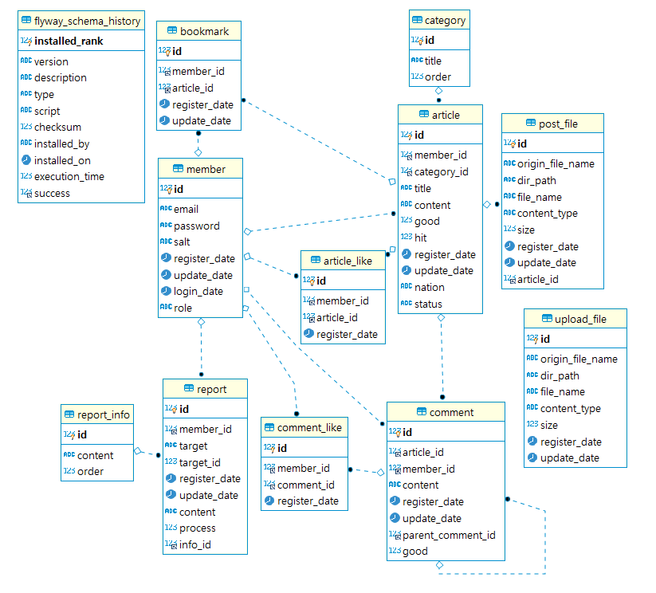
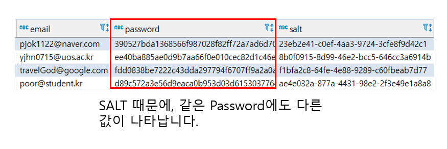
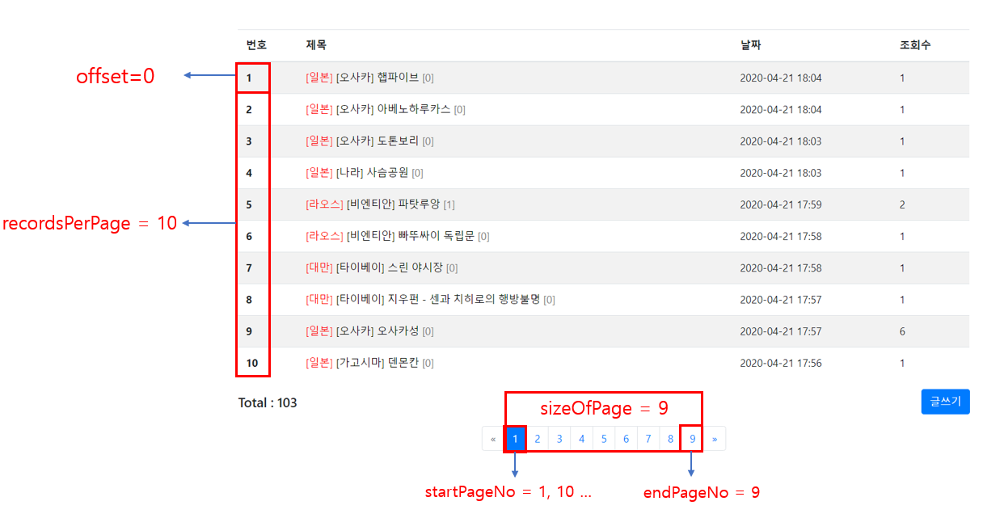

# Travel-Community V1.0

여행에 대한 자료를 공유하고, 토론하는 커뮤니티입니다.

## 프로젝트 시연 영상 

[](https://youtu.be/D_vpl5GnkeE)

## 기술스택

- `Spring boot` Version 2.2.4
    - `Java` Version 1.8
    - `Maven` 
    - `Spring Framework` Version 5.2.3
    - `Thymeleaf`  Version 3.0.11
    - `Junit` Version 4.12
- `Mybatis` Version 2.1.1
- `Flyway` Version 6.0.8
- `Mysql` Version 8.0.19
- `lombok` Version 1.18.10

<br>

- `javascript` 
- `Bootstrap` Version 4.4.1
- `jQuery` Version 3.4.1
- `Summernote` Version 0.8.16

<br>

- `github`

### 마일스톤, 화면 기획서, 요구사항 정리


## 데이터베이스 구조



## 기능 구현

### 회원 정보 저장

Spring security를 사용하지 않고, 직접 데이터베이스에 저장하는 방식으로 구현했습니다.

- `패스워드`를 원문 그대로 저장하는 것은 매우 위험합니다. 따라서 암호화를 하거나 해시화를 하는 것이 일반적입니다. 저는 `SHA-256` 해시 알고리즘을 이용해 패스워드를 저장했습니다. 

- 서로 다른 유저가 동일한 패스워드를 사용할 경우, `SHA-256`의 결과도 동일합니다. 이는 `통계적 공격`에 이용될 여지가 있습니다. 따라서 저는 `Salt`라는 난수를 생성하여 동일한 패스워드에도 `SHA-256` 결과가 다른 값을 같도록 만들었습니다.

**참고 사진**



#### Q. 암호화를 사용하지 않고 해시함수를 사용한 이유는?

패스워드 저장에 사용되는 암호 알고리즘은 `AES`와 같은 대칭키 알고리즘이 주로 사용됩니다. 즉, **키를 안전하게 보관할 의무가 생긴다는 단점**이 있습니다. 또한, 알고리즘의 시간복잡도를 고려했을 때에도, 암호화보다는 **해시화가 속도가 더 빠르다는 장점을 고려**했습니다.


<hr>

### 페이징

페이징 처리를 하기 위해 페이지에 대한 정보를 저장하는 클래스를 생성했습니다. 클래스의 구조는 다음과 같습니다.

```java
@Getter
public class Page {
    int recordsPerPage;      //한 페이지에 보여질 데이터의 수
    int firstPageNo;         //첫 번째 페이지 번호 1
    int finalPageNo;         //마지막 페이지 번호
    int currentPageNo;       //현재 페이지 번호  x
    int prevPageNo;          //이전 페이지 번호 x-1
    int nextPageNo;          //다음 페이지 번호 x+1
    int startPageNo;         //화면에서 보여지는 맨 왼쪽 페이지 번호
    int endPageNo;           //화면에서 보여지는 맨 오른쪽 페이지 번호
    int sizeOfPage;          //화면에서 보여지는 페이지 번호 수
    int numberOfRecords;     //전체 데이터 개수
    int offset;              //데이터 offset

    List<? extends CommonDomain> list;      //페이지에 저장될 데이터

    public Page(int currentPageNo) {
        this.currentPageNo = currentPageNo;
        this.recordsPerPage = 10;
        this.sizeOfPage = 9;
        this.startPageNo = 1;
        this.endPageNo = 1;
        this.finalPageNo = 1;
    }

    public Page(int currentPageNo, int numberOfRecords) {
        this(currentPageNo);
        this.numberOfRecords = numberOfRecords;
        makePageInfo();
    }

    public void setList(List<? extends CommonDomain> list) {
        this.list = list;
    }	

    public void setNumberOfRecordsAndMakePageInfo(int numberOfRecords) {
        this.numberOfRecords = numberOfRecords;
        makePageInfo();
    }


    public void makePageInfo() {
        if(currentPageNo <=0){
            currentPageNo= 1;			//기본 값 설정
            firstPageNo = 1;			//기본 값 설정
        }
        
        if(recordsPerPage == 0) {
            recordsPerPage = 10;		//기본 값 설정
        }

        if(numberOfRecords==0) { 		//게시물이 없는 경우
            return;
        }
        
        finalPageNo = (numberOfRecords + (recordsPerPage -1)) / recordsPerPage;
        
        if(currentPageNo > finalPageNo) {
            currentPageNo = finalPageNo;
        }
        
        startPageNo = ((currentPageNo-1) / sizeOfPage) * sizeOfPage + 1; //한 번에 보여지는 페이지 번호가 3개씩이라면, startPageNo= 1+3x 꼴이 된다.
        endPageNo = startPageNo + sizeOfPage - 1;
        endPageNo = (endPageNo > finalPageNo) ? finalPageNo : endPageNo;
        
        prevPageNo = (currentPageNo==1) ? 1 : currentPageNo-1;
        nextPageNo = (currentPageNo==finalPageNo) ? finalPageNo : currentPageNo+1;
        
        offset = (currentPageNo-1)*recordsPerPage;	
    }	
}
```



Page의 멤버변수 중 오해의 소지가 있는 변수는 그림으로 나타냈습니다.

- `startPageNo`, `sizeOfPage`, `endPageNo`를 계산해둠으로써 `Thymeleaf`에서는 단순히 값을 읽고 사용하기만 하면 됩니다. 이 값들을 멤버 변수로 둔 이유는 `유지보수` 때문입니다. 

- `Page` 내에 `list`를 두었습니다. `Controller`에서 `Model`에 담을 때 페이지정보, 데이터 정보 따로 담는 것보다, `Page` 하나에 담는 것이 더 편리하다고 생각했습니다. 그래서 `Page` 내에 `list`를 두었습니다.

- `List`에는 `Article` 외에도 `Comment` 등 다른 엔티티가 사용할 수 있게 하기 위해 `CommentDomain`이라는 객체를 두었습니다. `CommentDomain`에는 `registerDate`, `updateDate` 정보가 들어갑니다.


<hr>
